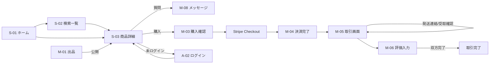

# 02. 画面要件(スマホファースト)

## 1. UI/UX 基本方針

- **スマホファースト**: すべての画面をモバイル幅 375px を基準に設計し、PC はレスポンシブ(コンテンツ最大幅 1280px、余白拡張・カラム数増加)で対応する
- ブレークポイント(Tailwind 標準): `sm: 640px` / `md: 768px` / `lg: 1024px` / `xl: 1280px`
- タップターゲットは 44×44px 以上。主要アクション(購入・出品公開など)は画面下部の固定ボタンで親指到達圏に配置
- ナビゲーション:
  - **スマホ**: 下部固定タブバー 5 項目(ホーム / さがす / 出品 / メッセージ / マイページ)。メッセージタブに未読バッジ
  - **PC**: 上部ヘッダー(ロゴ / 検索バー / 出品ボタン / お気に入り / メッセージ / アカウントメニュー)
- 画像は遅延読み込み+アスペクト比固定でレイアウトシフトを防止
- フォームはインラインバリデーション(blur 時)+送信時のサーバーバリデーション。エラーは項目直下に日本語で表示
- ローディングはスケルトン表示、操作結果はトースト通知で伝達
- 既製 UI コンポーネント(shadcn/ui)を原則そのまま使用し、独自デザインの作り込みは行わない

## 2. 画面一覧

### 公開画面(ゲスト閲覧可)

| ID | 画面 | パス | 主な内容 |
|---|---|---|---|
| S-01 | ホーム | `/` | 検索バー、カテゴリ導線(アイコングリッド)、新着商品、注目(お気に入り数上位)商品 |
| S-02 | 検索結果・一覧 | `/search` | キーワード・絞り込み・並び替え・商品グリッド(スマホ2列/PC4列)、フィルタ(スマホ: ボトムシート、PC: 左サイドバー) |
| S-03 | 商品詳細 | `/items/{id}` | 画像スライダー、価格、スペック表、説明、出品者カード、購入/お気に入り/質問/通報。スマホは下部固定の購入バー |
| S-04 | 公開プロフィール | `/users/{id}` | プロフィール、評価サマリー・評価一覧、出品中商品 |
| S-05 | 静的ページ | `/terms` ほか | 利用規約・プライバシーポリシー・特商法表記の掲載枠(文面は甲支給) |

### 認証画面

| ID | 画面 | パス | 主な内容 |
|---|---|---|---|
| A-01 | 会員登録 | `/signup` | メール/パスワード登録、Google ログインボタン |
| A-02 | ログイン | `/login` | メール/パスワード、Google、パスワードリセット導線 |
| A-03 | メール確認 | `/verify-email` | 確認メール送信済み案内・再送 |
| A-04 | パスワードリセット | `/reset-password` | メール入力 → 新パスワード設定 |

### 会員画面(要ログイン)

| ID | 画面 | パス | 主な内容 |
|---|---|---|---|
| M-01 | 出品フォーム | `/sell` | 画像アップロード(最大10枚・並び替え)、全出品項目、下書き保存 / 公開。1 画面縦スクロール構成 |
| M-02 | 出品編集 | `/sell/{id}/edit` | M-01 と同一フォーム |
| M-03 | 購入確認 | `/items/{id}/purchase` | 商品・価格・受渡方法の確認 →「支払いへ進む」(Stripe Checkout へ) |
| M-04 | 決済完了/失敗 | `/purchase/complete` 等 | 決済結果と取引画面への導線 |
| M-05 | 取引画面 | `/transactions/{id}` | ステータスタイムライン、次のアクションボタン(発送連絡/受取確認/評価)、相手情報、メッセージ導線 |
| M-06 | 評価入力 | `/transactions/{id}/review` | ★1〜5+コメント |
| M-07 | メッセージ一覧 | `/messages` | スレッド一覧(未読バッジ・最終メッセージ) |
| M-08 | メッセージスレッド | `/messages/{id}` | 吹き出し形式、商品ヘッダー、テキスト入力 |
| M-09 | マイページ | `/mypage` | プロフィール概要、メニュー(出品した商品 / 購入した取引 / お気に入り / 設定) |
| M-10 | 出品した商品 | `/mypage/listings` | 状態タブ(下書き/公開中/取引中/売却済/取下げ) |
| M-11 | 購入した取引 | `/mypage/purchases` | 進行中/完了タブ |
| M-12 | お気に入り一覧 | `/mypage/favorites` | 登録商品グリッド |
| M-13 | プロフィール編集 | `/mypage/profile` | 表示名・アイコン・自己紹介・所在地 |
| M-14 | 設定 | `/mypage/settings` | メール変更、パスワード変更、通知設定、退会 |
| M-15 | 通報フォーム | モーダル | 理由区分+詳細 |

### 管理画面(管理者のみ、PC 優先・スマホ閲覧可)

| ID | 画面 | パス | 主な内容 |
|---|---|---|---|
| AD-01 | ダッシュボード | `/admin` | KPI カード(会員/出品/取引/GMV)、直近30日グラフ、最新通報・取引 |
| AD-02 | 利用者管理 | `/admin/users` | 一覧・検索・詳細・非表示化 |
| AD-03 | 出品管理 | `/admin/listings` | 一覧・検索・詳細・非表示化 |
| AD-04 | 取引管理 | `/admin/transactions` | 一覧・検索・詳細・キャンセル操作 |
| AD-05 | 通報管理 | `/admin/reports` | 一覧・対応ステータス更新 |
| AD-06 | ブランド管理 | `/admin/brands` | マスタ CRUD |

## 3. 主要画面遷移

## 4. 状態別表示の要点

- 商品詳細の主ボタン: 公開中=「購入手続きへ」/ 取引中=無効「取引中」/ 売却済=無効「SOLD」/ 本人=「編集」
- 取引画面の主ボタンは現在ステータスと自分の役割で切替(出品者: 発送連絡 → 評価、購入者: 受取確認 → 評価)。相手待ちの間は「相手の◯◯待ち」を表示
- 空状態(検索0件・お気に入り0件・メッセージ0件等)には案内文と次のアクション導線を表示
