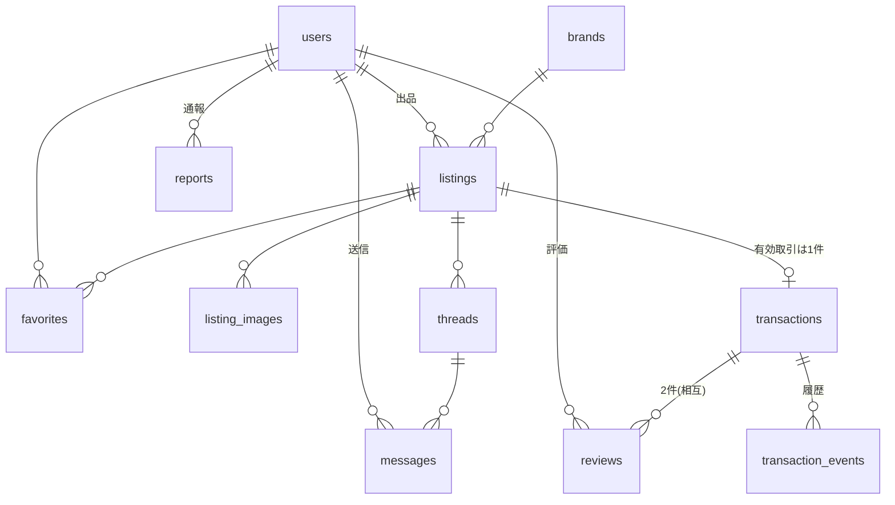

# 03. データモデル

RDB は PostgreSQL(Supabase)。主キーは UUID、全テーブルに `created_at` / `updated_at` (timestamptz) を持つ。

## 1. ER 図

## 2. テーブル定義

### users(ユーザー)

| カラム | 型 | 制約 | 説明 |
|---|---|---|---|
| id | uuid | PK | 認証基盤(Supabase Auth)のユーザー ID と一致 |
| email | text | UNIQUE NOT NULL | 認証基盤と同期 |
| display_name | text | NOT NULL | 1〜30 文字 |
| avatar_url | text | | アイコン画像 URL |
| bio | text | | 自己紹介(〜1,000 文字) |
| prefecture | text | | 都道府県コード(JIS X 0401、'01'〜'47')、NULL 可 |
| role | text | NOT NULL default 'user' | 'user' / 'admin' |
| status | text | NOT NULL default 'active' | 'active' / 'suspended'(管理者非表示)/ 'withdrawn'(退会) |
| email_verified_at | timestamptz | | メール確認日時 |
| notification_prefs | jsonb | NOT NULL default '{}' | 通知カテゴリごとの ON/OFF |
| withdrawn_at | timestamptz | | 退会日時 |

### brands(ブランドマスタ)

| カラム | 型 | 制約 |
|---|---|---|
| id | uuid | PK |
| name | text | UNIQUE NOT NULL |
| is_active | boolean | NOT NULL default true |

### listings(商品)

| カラム | 型 | 制約 | 説明 |
|---|---|---|---|
| id | uuid | PK | |
| seller_id | uuid | FK→users NOT NULL | |
| status | text | NOT NULL default 'draft' | 'draft' / 'published' / 'trading' / 'sold' / 'withdrawn' / 'suspended' |
| category | text | NOT NULL | 'road' / 'cross' / 'mtb' / 'city' / 'minivelo' / 'ebike' / 'parts' / 'other' |
| parts_subcategory | text | | パーツ時のみ('frame' / 'wheel' / 'component' / 'cockpit' / 'saddle' / 'pedal' / 'tire' / 'accessory' / 'other') |
| title | text | NOT NULL | 5〜80 文字(下書きは 1 文字〜) |
| brand_id | uuid | FK→brands | |
| brand_other | text | | 「その他」時の自由入力 |
| model_name | text | | |
| model_year | int | | 1980〜、NULL=不明 |
| frame_size | text | | 'XS'/'S'/'M'/'L'/'XL'/'other' |
| frame_size_cm | numeric | | 任意の数値(cm) |
| component | text | | グレード選択値 |
| component_note | text | | 補足 |
| mileage | text | | 'lte100'/'lte500'/'lte1000'/'lte3000'/'lte5000'/'gt5000'/'unknown' |
| condition | text | NOT NULL(公開時) | 'new'/'like_new'/'good'/'fair'/'poor'/'junk' |
| description | text | | 10〜2,000 文字(公開時必須) |
| price | int | | 300〜9,999,999(公開時必須) |
| delivery_method | text | | 'shipping' / 'in_person' |
| shipping_from_pref | text | | 発送元都道府県 |
| meetup_pref | text | | 対面受渡の都道府県 |
| favorites_count | int | NOT NULL default 0 | 非正規化カウンタ |
| published_at | timestamptz | | 初回公開日時 |
| suspended_reason | text | | 管理者非表示の理由メモ |

- INDEX: (status, published_at desc)、(category)、(brand_id)、(price)、(shipping_from_pref)、全文検索用 GIN(title, description, model_name)

### listing_images(商品画像)

| カラム | 型 | 制約 |
|---|---|---|
| id | uuid | PK |
| listing_id | uuid | FK→listings NOT NULL(CASCADE) |
| url | text | NOT NULL |
| thumbnail_url | text | NOT NULL |
| position | int | NOT NULL(0〜9、listing 内で一意) |

### favorites(お気に入り)

| カラム | 型 | 制約 |
|---|---|---|
| user_id | uuid | FK→users、複合 PK |
| listing_id | uuid | FK→listings、複合 PK |
| created_at | timestamptz | |

### threads(メッセージスレッド)

| カラム | 型 | 制約 | 説明 |
|---|---|---|---|
| id | uuid | PK | |
| listing_id | uuid | FK→listings NOT NULL | |
| buyer_id | uuid | FK→users NOT NULL | 購入希望者側 |
| UNIQUE(listing_id, buyer_id) | | | 商品×購入希望者で 1 スレッド |
| last_message_at | timestamptz | | 一覧の並び替え用 |

### messages(メッセージ)

| カラム | 型 | 制約 | 説明 |
|---|---|---|---|
| id | uuid | PK | |
| thread_id | uuid | FK→threads NOT NULL | |
| sender_id | uuid | FK→users NOT NULL | |
| body | text | NOT NULL | 1〜1,000 文字 |
| read_at | timestamptz | | 受信者が閲覧した日時(未読管理用) |

### transactions(取引)

| カラム | 型 | 制約 | 説明 |
|---|---|---|---|
| id | uuid | PK | |
| listing_id | uuid | FK→listings NOT NULL | |
| seller_id | uuid | FK→users NOT NULL | 冪等参照用に非正規化 |
| buyer_id | uuid | FK→users NOT NULL | |
| status | text | NOT NULL | 'pending_payment' / 'paid' / 'shipped' / 'received' / 'completed' / 'canceled' |
| price | int | NOT NULL | 成約価格(スナップショット) |
| stripe_session_id | text | UNIQUE | Checkout Session ID |
| stripe_payment_intent_id | text | | |
| shipping_note | text | | 発送・受渡連絡メモ |
| paid_at / shipped_at / received_at / completed_at / canceled_at | timestamptz | | 各遷移日時 |
| canceled_reason | text | | 管理者キャンセル理由 |

- 部分 UNIQUE INDEX: `listing_id WHERE status NOT IN ('canceled')` — 1 商品につき有効取引 1 件を DB レベルで保証

### transaction_events(取引履歴)

| カラム | 型 | 説明 |
|---|---|---|
| id | uuid | PK |
| transaction_id | uuid | FK→transactions |
| actor_id | uuid | 操作者(システム/Webhook は NULL) |
| event | text | 'created' / 'paid' / 'shipped' / 'received' / 'reviewed' / 'completed' / 'canceled' |
| note | text | |

### reviews(評価)

| カラム | 型 | 制約 | 説明 |
|---|---|---|---|
| id | uuid | PK | |
| transaction_id | uuid | FK→transactions NOT NULL | |
| reviewer_id | uuid | FK→users NOT NULL | |
| reviewee_id | uuid | FK→users NOT NULL | |
| rating | int | NOT NULL CHECK(1〜5) | |
| comment | text | | 〜500 文字 |
| is_published | boolean | NOT NULL default false | 双方完了 or 14 日経過で true |
| is_hidden | boolean | NOT NULL default false | 管理者非表示 |
| UNIQUE(transaction_id, reviewer_id) | | | 取引×評価者で 1 件 |

### reports(通報)

| カラム | 型 | 制約 | 説明 |
|---|---|---|---|
| id | uuid | PK | |
| reporter_id | uuid | FK→users NOT NULL | |
| target_type | text | NOT NULL | 'listing' / 'user' |
| target_id | uuid | NOT NULL | |
| reason | text | NOT NULL | 'prohibited' / 'fraud' / 'inappropriate' / 'tos_violation' / 'other' |
| detail | text | | 〜1,000 文字 |
| status | text | NOT NULL default 'open' | 'open' / 'resolved' |
| resolved_by | uuid | FK→users | 対応した管理者 |
| resolved_note | text | | |
| UNIQUE(reporter_id, target_type, target_id) | | | 同一対象への重複通報防止 |

### email_logs(メール送信ログ)

| カラム | 型 | 説明 |
|---|---|---|
| id | uuid | PK |
| user_id | uuid | 宛先ユーザー |
| kind | text | FR-13 のイベント種別 |
| status | text | 'sent' / 'failed' |
| error | text | 失敗理由 |

## 3. データアクセス制御方針

- Supabase RLS(Row Level Security)を全テーブルで有効化
  - listings: published/trading/sold は全員 SELECT 可。draft/withdrawn は本人のみ。suspended は本人+管理者のみ
  - threads/messages: 参加者(出品者・購入希望者)と管理者のみ
  - transactions: 当事者と管理者のみ
  - reviews: is_published かつ非 hidden は全員、未公開は評価者本人と管理者のみ
  - reports: 通報者本人(自分の通報)と管理者のみ
- 書き込みを伴う業務ロジック(購入、ステータス遷移、Webhook 処理)はサーバーサイド(Route Handler / Server Action)で service role により実行し、遷移条件を検証する
